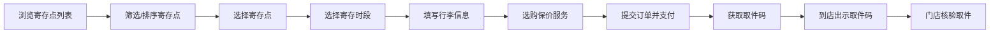

## 1. 产品概述

行李寄存 Web 应用是一个面向游客、车站周边门店和平台客服的一站式行李寄存服务平台。游客可在线筛选寄存点、预约寄存时段、在线支付并获取取件码；门店通过扫码入库、拍照留档等功能高效管理寄存业务；客服处理各类售后问题；运营人员维护门店资料和价格规则，查看运营报表。

- 核心目标：解决游客出行时行李携带不便的痛点，连接线下寄存门店与线上用户
- 市场价值：提升车站、商圈周边寄存门店的运营效率和收益，为游客提供便捷、安全的寄存服务

## 2. 核心功能

### 2.1 用户角色

| 角色 | 登录方式 | 核心权限 |
|------|----------|----------|
| 游客 | 手机号登录 | 浏览寄存点、下单预约、支付、查看订单、取件核验 |
| 门店商家 | 门店账号登录 | 扫码入库、拍照留档、柜位管理、超时标记、续存办理、取件确认 |
| 平台客服 | 客服账号登录 | 订单取消处理、遗失申报处理、赔付申请处理、差评回访 |
| 运营管理员 | 管理员账号登录 | 门店资料维护、价格规则配置、节假日容量管理、结算明细查看 |

### 2.2 功能模块

1. **寄存点列表页**：寄存点卡片展示、多维度筛选（位置/营业时间/箱包尺寸/价格/评分）、剩余容量显示、排序功能
2. **地图检索页**：地图可视化展示寄存点分布、位置搜索、周边寄存点查询、点位详情弹窗
3. **下单页**：寄存时段选择、行李件数填写、保价服务选购、价格计算、取件码生成、在线支付
4. **订单中心**：订单列表（进行中/已完成/已取消）、订单详情、取消申请、评价功能
5. **取件核验页**：取件码输入/扫码核验、取件状态展示
6. **门店工作台**：扫码入库、拍照留档、柜位修改、超时标记、续存办理、取件确认、今日数据概览
7. **客服处理页**：取消申请列表、遗失申报列表、赔付申请列表、差评回访列表、工单处理
8. **运营报表页**：门店资料管理、价格规则配置、节假日容量设置、结算明细、数据统计图表

### 2.3 页面详情

| 页面名称 | 模块名称 | 功能描述 |
|----------|----------|----------|
| 寄存点列表 | 顶部筛选栏 | 位置搜索、营业时间筛选、尺寸筛选、价格区间、评分筛选 |
| 寄存点列表 | 寄存点卡片 | 门店名称、地址、距离、营业时间、价格、评分、剩余容量、立即预约按钮 |
| 寄存点列表 | 排序功能 | 按距离、价格、评分、人气排序 |
| 地图检索 | 地图区域 | 地图展示、寄存点标记、当前位置 |
| 地图检索 | 搜索栏 | 地址搜索、位置定位 |
| 地图检索 | 详情浮窗 | 寄存点基本信息、快捷预约入口 |
| 下单页 | 寄存点信息 | 门店名称、地址、营业时间、联系方式 |
| 下单页 | 时段选择 | 寄存开始时间、结束时间选择器 |
| 下单页 | 行李信息 | 行李件数、尺寸选择、单件行李信息 |
| 下单页 | 增值服务 | 保价服务（可选保额）、其他增值服务 |
| 下单页 | 费用明细 | 基础费用、保价费用、总计金额 |
| 下单页 | 支付模块 | 支付方式选择、确认支付按钮 |
| 订单中心 | 订单分类标签 | 全部/进行中/已完成/已取消 |
| 订单中心 | 订单卡片 | 订单号、门店名称、寄存时段、状态、金额 |
| 订单中心 | 订单详情 | 完整订单信息、操作按钮（取消/评价/查看取件码） |
| 取件核验 | 取件码输入 | 取件码输入框、扫码入口 |
| 取件核验 | 核验结果 | 取件成功/失败状态、订单信息展示 |
| 门店工作台 | 数据概览 | 今日寄存数、取件数、营收、在柜数量 |
| 门店工作台 | 功能入口 | 扫码入库、取件确认、超时管理、续存办理 |
| 门店工作台 | 在柜列表 | 当前寄存中的行李列表、柜位信息、入库时间 |
| 门店工作台 | 入库操作 | 扫码、拍照、选择柜位、确认入库 |
| 门店工作台 | 取件操作 | 核验取件码、确认取件 |
| 客服处理 | 工单分类 | 取消申请/遗失申报/赔付申请/差评回访 |
| 客服处理 | 工单列表 | 工单卡片、状态标签、处理按钮 |
| 客服处理 | 工单详情 | 工单详细信息、处理记录、操作面板 |
| 运营报表 | 门店管理 | 门店列表、新增/编辑门店、门店状态管理 |
| 运营报表 | 价格规则 | 基础价格设置、时段定价、尺寸定价 |
| 运营报表 | 节假日管理 | 节假日配置、容量调整、价格上浮 |
| 运营报表 | 结算明细 | 门店结算列表、结算详情、导出功能 |
| 运营报表 | 数据统计 | 订单量趋势、营收统计、寄存点热力图 |

## 3. 核心流程

### 3.1 游客寄存流程

游客打开寄存点列表，通过筛选条件找到合适的寄存点，选择门店进入下单页，填写寄存时段和行李信息，选购保价服务后提交订单并支付，获得取件码。到店后出示取件码，门店核验后完成取件。

### 3.2 门店入库流程

门店收到游客行李后，通过扫码或手动输入订单号，确认订单信息，对行李拍照留档，分配存放柜位，确认入库，系统更新订单状态并通知用户。

### 3.3 客服处理流程

用户提交取消/遗失/赔付申请后，客服收到工单，审核申请内容，联系用户核实情况，根据政策给出处理方案，执行处理操作并记录处理结果。

## 4. 用户界面设计

### 4.1 设计风格

- **主色调**：深青色 #0D9488（teal-600）作为主色，传达专业、可靠、安全的感觉
- **辅助色**：琥珀橙 #F59E0B（amber-500）作为强调色，用于按钮高亮和重要信息
- **中性色**：以 slate 色系为基础，从 slate-50 到 slate-900，构建清晰的视觉层次
- **按钮风格**：圆角中等（rounded-lg），悬停有微缩放和阴影变化，点击有按压反馈
- **字体**：标题使用 Noto Sans SC 中粗体，正文使用 Noto Sans SC 常规体，数字使用等宽字体
- **布局风格**：卡片式布局，清晰的分区，充足的留白，信息层级分明
- **图标风格**：使用 lucide-react 线性图标，保持统一的线条粗细和视觉风格

### 4.2 页面设计概览

| 页面名称 | 模块名称 | UI 元素 |
|----------|----------|---------|
| 寄存点列表 | 顶部筛选栏 | 固定顶部、可展开筛选面板、标签式筛选条件 |
| 寄存点列表 | 寄存点卡片 | 白色卡片、浅灰边框、悬停上浮效果、左侧图片/右侧信息 |
| 寄存点列表 | 排序切换 | 横向滚动标签栏、选中态高亮 |
| 地图检索 | 地图区域 | 全屏地图、底部浮动搜索栏、点位标记动画 |
| 地图检索 | 详情浮窗 | 从底部滑入、圆角顶部、可拖动展开 |
| 下单页 | 表单区域 | 分组卡片、左标签右输入、清晰的必填标识 |
| 下单页 | 费用明细 | 固定底部、半透明背景、毛玻璃效果、悬浮提交按钮 |
| 订单中心 | 订单卡片 | 时间线式布局、状态色标、操作按钮组 |
| 门店工作台 | 数据概览 | 四宫格数据卡、渐变色背景、数字动画 |
| 门店工作台 | 功能入口 | 图标按钮网格、点击波纹效果 |
| 运营报表 | 数据图表 | 折线图/柱状图、渐变填充、交互式悬停提示 |
| 运营报表 | 管理表格 | 斑马纹、悬停高亮、操作列固定 |

### 4.3 响应式设计

- **设计原则**：桌面端优先设计，向下适配平板和手机
- **断点设置**：sm (640px)、md (768px)、lg (1024px)、xl (1280px)
- **移动端适配**：导航转为底部 Tab 栏，筛选面板改为全屏抽屉，卡片改为单列布局
- **触摸优化**：按钮最小尺寸 44px，手势滑动支持，双击缩放禁用

### 4.4 动效与交互

- **页面切换**：淡入淡出 + 轻微位移动画，时长 200ms
- **卡片悬停**：上移 2px + 阴影加深，时长 150ms，ease-out
- **按钮反馈**：点击时缩放至 98%，释放后回弹
- **数据加载**：骨架屏占位，内容渐入显示
- **模态弹窗**：背景模糊 + 缩放进入，从中心弹出
- **数字变化**：数字滚动动画，增强数据感知
