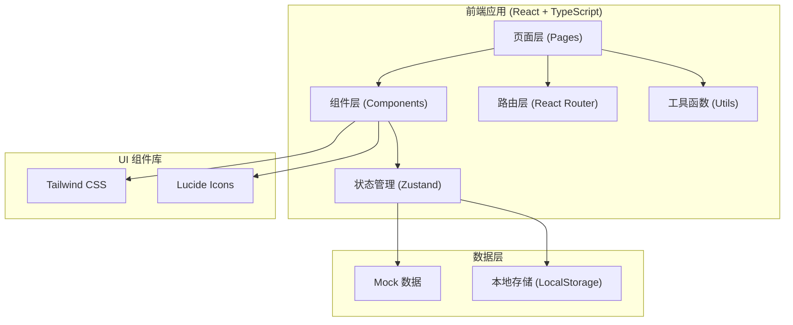
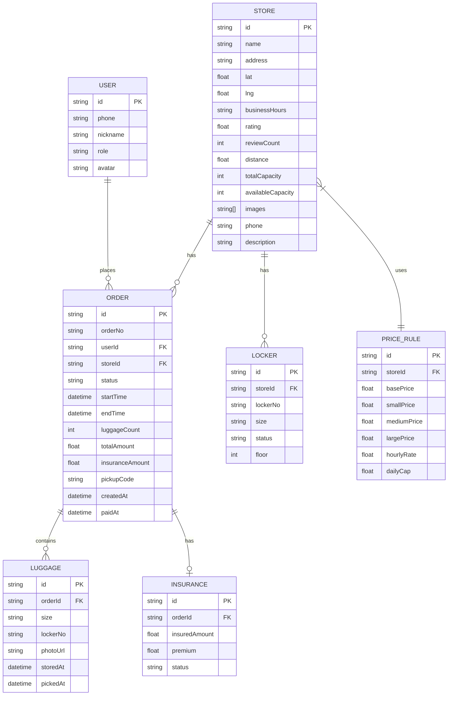

## 1. 架构设计



## 2. 技术描述

- **前端框架**：React@18 + TypeScript
- **构建工具**：Vite@5
- **路由管理**：react-router-dom@6
- **状态管理**：zustand@4
- **样式方案**：tailwindcss@3
- **图标库**：lucide-react
- **数据方案**：Mock 数据 + LocalStorage 持久化
- **初始化工具**：vite-init
- **项目模板**：react-ts

## 3. 路由定义

| 路由路径 | 页面名称 | 角色权限 |
|----------|----------|----------|
| / | 寄存点列表 | 游客 |
| /map | 地图检索 | 游客 |
| /order/create/:storeId | 下单页 | 游客 |
| /orders | 订单中心 | 游客 |
| /pickup | 取件核验 | 游客/门店 |
| /store/workbench | 门店工作台 | 门店商家 |
| /service | 客服处理 | 平台客服 |
| /admin | 运营报表 | 运营管理员 |

## 4. 数据模型

### 4.1 数据模型定义



### 4.2 核心类型定义

```typescript
// 寄存点
interface Store {
  id: string;
  name: string;
  address: string;
  lat: number;
  lng: number;
  businessHours: string;
  rating: number;
  reviewCount: number;
  distance: number;
  totalCapacity: number;
  availableCapacity: number;
  images: string[];
  phone: string;
  description: string;
  basePrice: number;
}

// 订单
interface Order {
  id: string;
  orderNo: string;
  userId: string;
  storeId: string;
  storeName: string;
  status: 'pending' | 'paid' | 'stored' | 'picked' | 'cancelled' | 'overdue';
  startTime: string;
  endTime: string;
  luggageCount: number;
  luggages: LuggageItem[];
  totalAmount: number;
  insuranceAmount: number;
  insurance: Insurance | null;
  pickupCode: string;
  createdAt: string;
  paidAt?: string;
  storedAt?: string;
  pickedAt?: string;
}

// 行李项
interface LuggageItem {
  id: string;
  size: 'small' | 'medium' | 'large';
  lockerNo?: string;
  photoUrl?: string;
}

// 保价
interface Insurance {
  id: string;
  insuredAmount: number;
  premium: number;
  status: 'active' | 'claimed' | 'expired';
}

// 筛选条件
interface FilterParams {
  keyword?: string;
  location?: string;
  openNow?: boolean;
  size?: ('small' | 'medium' | 'large')[];
  priceMin?: number;
  priceMax?: number;
  minRating?: number;
  sortBy?: 'distance' | 'price' | 'rating' | 'popular';
}
```

## 5. 项目结构

```
src/
├── components/          # 通用组件
│   ├── Layout/         # 布局组件
│   ├── StoreCard/      # 寄存点卡片
│   ├── OrderCard/      # 订单卡片
│   ├── FilterBar/      # 筛选栏
│   └── Modal/          # 弹窗组件
├── pages/              # 页面组件
│   ├── StoreList/      # 寄存点列表
│   ├── MapSearch/      # 地图检索
│   ├── OrderCreate/    # 下单页
│   ├── OrderCenter/    # 订单中心
│   ├── PickupVerify/   # 取件核验
│   ├── StoreWorkbench/ # 门店工作台
│   ├── ServiceCenter/  # 客服处理
│   └── AdminDashboard/ # 运营报表
├── store/              # 状态管理 (zustand)
│   ├── useStoreStore.ts
│   ├── useOrderStore.ts
│   └── useUserStore.ts
├── data/               # Mock 数据
│   ├── stores.ts
│   ├── orders.ts
│   └── users.ts
├── utils/              # 工具函数
│   ├── format.ts
│   ├── price.ts
│   └── code.ts
├── types/              # 类型定义
│   └── index.ts
├── App.tsx
├── main.tsx
└── index.css
```

## 6. 状态管理设计

### 6.1 寄存点状态 (useStoreStore)
- stores: Store[] - 寄存点列表
- filters: FilterParams - 筛选条件
- selectedStore: Store | null - 当前选中的寄存点
- actions: setFilters, toggleFilter, selectStore

### 6.2 订单状态 (useOrderStore)
- orders: Order[] - 订单列表
- currentOrder: Order | null - 当前订单
- actions: createOrder, updateOrderStatus, getOrderById

### 6.3 用户状态 (useUserStore)
- user: User | null - 当前用户
- role: 'visitor' | 'store' | 'service' | 'admin' - 当前角色
- actions: login, logout, switchRole
